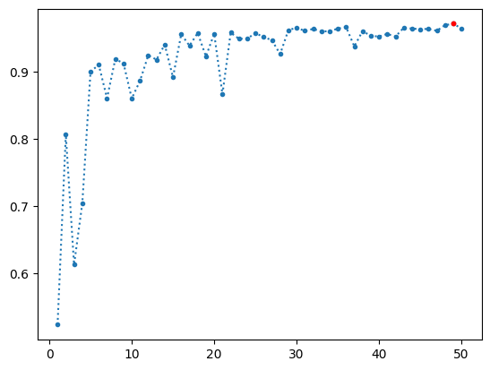
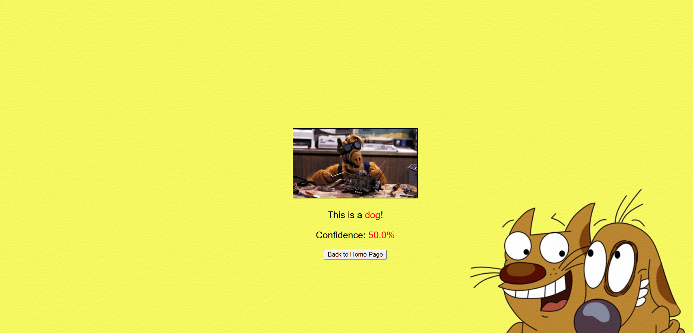
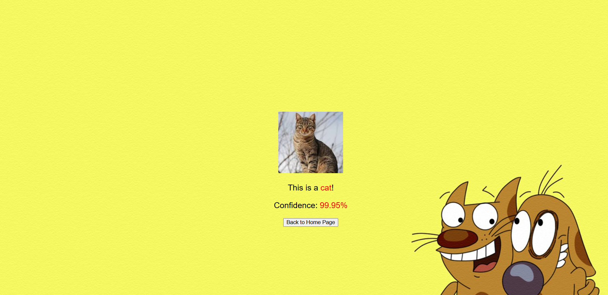
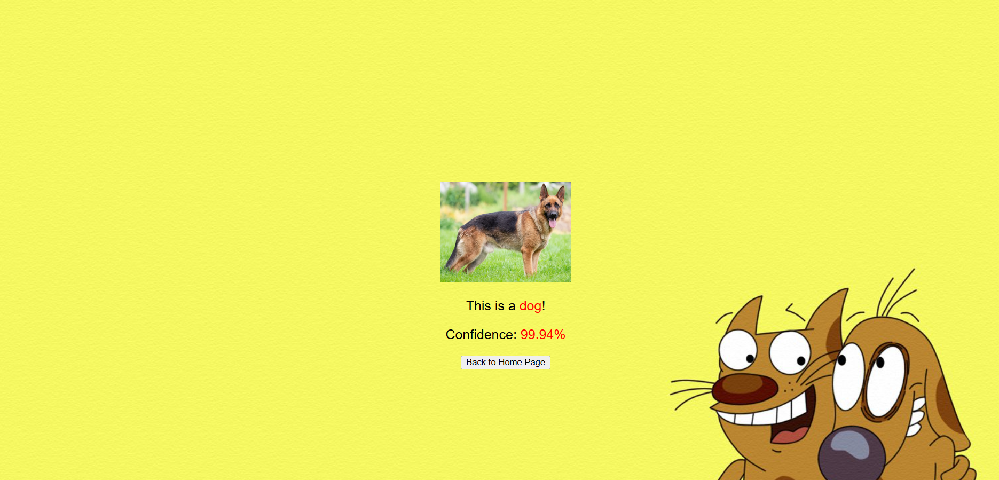
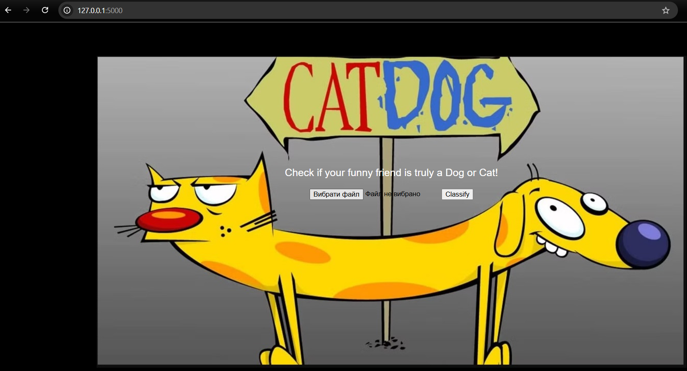

# Classification-Web-App (Vladyslav Slobodian)

I want to build a Flask application that performs image classification to distinguish between cats and dogs.

# Installation

Please make sure Python 3 is installed before proceeding.
```
git clone https://github.com/VladSlob/Classification-Web-App/tree/develoy
cd classification_web_app
python -m venv venv
venv\Scripts\activate
pip install -r requirements.txt
python -m flask run #run flask app
```

# Getting access

- Get start page /
- Get result page /classify

# Features

- Upload image from user
- Classify image by using machine learning model
- Return probability who is on the picture cat or dog.
- Use dataset for train ML model: Cat & Dog images for Classification (https://www.kaggle.com/datasets/ashfakyeafi/cat-dog-images-for-classification)
- Google colab ML project and model: Classification Web App.ipynb (https://colab.research.google.com/drive/1uEUA_nuzGQ_SCkgUahGR_aAOhGTVVBIi?usp=sharing)
- Trained 50 epochs and chosen 49 epochs with max val_accuracy: 0.9714.



# Demo Images





